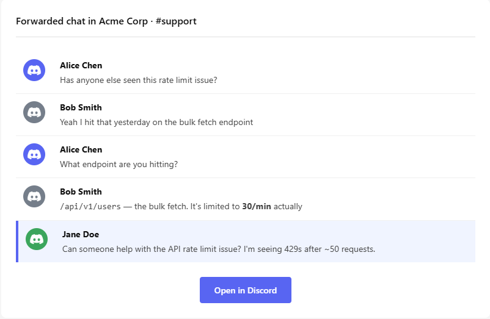

# ✉️ fwd2email

Google Chat has "Forward to inbox." Discord doesn't. Now it does.

Right-click any message, select **Apps** > **Forward to inbox**, and a formatted email lands in your Gmail — with context, avatars, and a link back.

<p align="center">
  
</p>

## 📖 Table of contents

- [Getting started](#-getting-started)
  - [1. Create a Discord application](#1-create-a-discord-application)
  - [2. Set up Gmail](#2-set-up-gmail)
  - [3. Install and run the server](#3-install-and-run-the-server)
  - [4. Install the app to your Discord account](#4-install-the-app-to-your-discord-account)
- [Configuration](#%EF%B8%8F-configuration)
- [Gateway vs webhook mode](#-gateway-vs-webhook-mode)
- [Adding the bot to a server](#-adding-the-bot-to-a-server)

## 🚀 Getting started

### 1. Create a Discord application

1. Go to [discord.com/developers/applications](https://discord.com/developers/applications) and click **New Application**
2. Give it a name (e.g. "Forward to Email") and create it
3. On the **General Information** page, copy the **Application ID** — this is your `DISCORD_APP_ID`
4. Copy the **Public Key** — this is your `DISCORD_PUBLIC_KEY` (needed for webhook mode)
5. Go to **Bot** in the left sidebar, click **Reset Token**, and copy it — this is your `DISCORD_TOKEN`
6. Go to **Installation** in the left sidebar and check **User Install**

### 2. Set up Resend

1. Create a free account at [resend.com](https://resend.com)
2. Go to **API Keys** and create a new key — this is your `RESEND_API_KEY`
3. Go to **Domains** and add a sending domain, or use the default `onboarding@resend.dev` for testing

### 3. Install and run the server

<details open>
<summary>Download a binary</summary>

```sh
VERSION="0.1.0"
OS="linux"       # or: darwin
ARCH="amd64"     # or: arm64

curl -L "https://github.com/kurtisvg/discord-fwd2email/releases/download/v${VERSION}/discord-fwd2email_${VERSION}_${OS}_${ARCH}" -o fwd2email
chmod +x fwd2email
```

Or download from the [releases page](https://github.com/kurtisvg/discord-fwd2email/releases/latest).

</details>

<details>
<summary>Docker</summary>

```sh
docker run --rm \
  -e DISCORD_TOKEN='your-bot-token' \
  -e DISCORD_APP_ID='your-app-id' \
  -e EMAIL_PROVIDER='resend' \
  -e RESEND_API_KEY='re_xxxxxxxxx' \
  -e FROM_EMAIL='forwarded@yourdomain.com' \
  -e TO_EMAIL='you@example.com' \
  ghcr.io/kurtisvg/fwd2email:latest -gateway
```

</details>

<details>
<summary>Go install</summary>

```sh
go install github.com/kurtisvg/discord-fwd2email@latest
```

</details>

<details>
<summary>Build from source</summary>

```sh
git clone https://github.com/kurtisvg/discord-fwd2email.git && cd discord-fwd2email
go build -o fwd2email .
```

</details>

Configure and run:

```sh
export DISCORD_TOKEN='your-bot-token'
export DISCORD_APP_ID='your-app-id'
export RESEND_API_KEY='re_xxxxxxxxx'
export FROM_EMAIL='forwarded@yourdomain.com'
export TO_EMAIL='you@example.com'

./fwd2email -gateway
```

The bot registers its command on startup.

### 4. Install the app to your Discord account

> **⚠️ Important:** Discord bots are public by default, meaning anyone can install and use yours — including sending emails through your account. Go to **Bot** in the Developer Portal and uncheck **Public Bot** to restrict it to your account only.

1. In the Developer Portal, go to **OAuth2** > **URL Generator**
2. Select the `applications.commands` scope
3. Copy the generated URL and open it in your browser
4. Choose **Install to my account** and authorize

You're all set. Right-click any message > **Apps** > **Forward to inbox**.

## ⚙️ Configuration

Everything is configurable via flags or environment variables. Flags take precedence.

```
-discord-token     / DISCORD_TOKEN        Bot token (required)
-discord-app-id    / DISCORD_APP_ID       Application ID (required)
-discord-public-key / DISCORD_PUBLIC_KEY  Public key (webhook mode only)
-resend-api-key    / RESEND_API_KEY       Resend API key (required)
-from-email        / FROM_EMAIL           Sender email address (required)
-to-email          / TO_EMAIL             Recipient email address (required)
-host              / HOST                 Server host (default: all interfaces)
-port              / PORT                 Server port (default: 8080)
-gateway                                  Use websocket mode instead of webhooks
```

## 🔌 Gateway vs webhook mode

**Gateway mode** — connects to Discord via websocket. No public URL, no signature verification. Great for local dev and personal use.

```sh
./fwd2email -gateway
```

**Webhook mode** — runs an HTTP server that receives interaction POSTs from Discord. Requires a public HTTPS URL and the public key for signature verification. This is what you'd use on Cloud Run or similar.

```sh
./fwd2email
# Then set your Interactions Endpoint URL in the Discord Developer Portal
# to https://your-domain/interactions
```

## 🏠 Adding the bot to a server

By default, the bot is installed to your user account. It can forward any message you can see, but it can only fetch context messages (the 5 messages before the target) in servers where it's a member.

To add context message support in a server:

1. In the Developer Portal, go to **Installation** and enable **Guild Install**
2. Go to **OAuth2** > **URL Generator**
3. Select scopes: `bot` and `applications.commands`
4. Select bot permissions: **Read Message History**
5. Copy the URL and open it in your browser
6. Select the server you want to add it to

In servers where the bot isn't a member, it gracefully falls back to forwarding just the target message.
